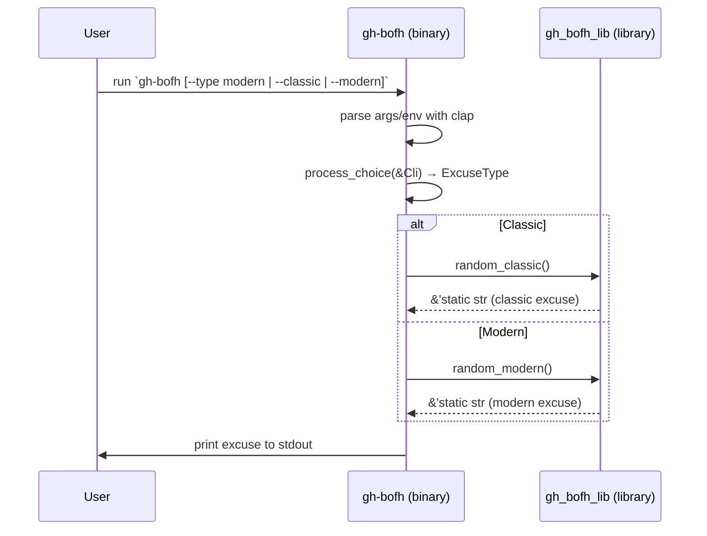

<!--
SPDX-FileCopyrightText: 2024 - 2025 Ali Sajid Imami

SPDX-License-Identifier: Apache-2.0
SPDX-License-Identifier: MIT
-->

# Architecture Documentation

This document describes the high-level design of `gh-bofh`, a GitHub CLI extension and standalone binary that prints a random BOFH (Bastard Operator From Hell) excuse. It explains the major components, their responsibilities, the relationships among them, and key properties that shape the system.

References to source files use the current repository layout under `src/`.

## System overview

The system comprises two crates that form a clear library/binary split:

- Library crate: `gh_bofh_lib` (files: `src/gh_bofh_lib/lib.rs`, `src/gh_bofh_lib/excuses.rs`)
  - Owns the public API for generating excuses and the static excuse lists.
  - Provides functions `random_classic()` and `random_modern()` to pick an excuse at random.
- Binary crate: `gh-bofh` (files: `src/gh_bofh/main.rs`, `src/gh_bofh/cli.rs`)
  - Parses CLI input and environment configuration.
  - Delegates to the library to retrieve an excuse, then prints it to stdout.

The design keeps runtime logic minimal in the binary and concentrates domain data and selection logic in the library. This separation allows reuse from other binaries or tests and keeps the CLI surface small and predictable.

## Component responsibilities and boundaries

### Library: `gh_bofh_lib`

- Public data:
  - `pub const CLASSIC: [&str; N]` and `pub const MODERN: [&str; M]` in `src/gh_bofh_lib/excuses.rs` expose immutable, compile‑time constant lists of excuses. These are part of the public API so other crates can inspect or iterate them if needed.

- Public functions (in `src/gh_bofh_lib/lib.rs`):
  - `pub fn random_classic() -> &'static str`
  - `pub fn random_modern() -> &'static str`
  - Both use `rand::prelude::IndexedRandom::choose` with `rand::rng()` to select a random element. If (defensively) the list were empty, they return a friendly fallback string via `unwrap_or(...)`.

- Invariants and properties:
  - No I/O, no global state, and no environment dependency. The functions are pure in the sense that they only depend on RNG state and internal constants.
  - Memory safety is enforced (no `unsafe`), and doctests verify example usage. Lints for rustdoc are configured to keep docs accurate.

### Binary: `gh-bofh`

- CLI definition (in `src/gh_bofh/cli.rs`):
  - `ExcuseType` enum: `Classic | Modern` implements `clap::ValueEnum` for typed parsing.
  - `Cli` struct with flags:
    - `-t, --type <TYPE>` or environment variable `EXCUSE_TYPE` (value‑enum) — default `classic`.
    - `-c, --classic` and `-m, --modern` as mutually exclusive convenience flags.
  - Tests in this file verify parsing behavior (defaults, flags, and `EXCUSE_TYPE`).

- Entrypoint (in `src/gh_bofh/main.rs`):
  - Parses `Cli` with `clap::Parser`.
  - `process_choice(&Cli) -> ExcuseType` resolves precedence:
      1. If `--classic` is set → `Classic`.
      2. Else if `--modern` is set → `Modern`.
      3. Else → the `excuse_type` from `--type` or `EXCUSE_TYPE` (default `Classic`).
  - Matches on `ExcuseType` and prints `random_classic()` or `random_modern()` to stdout.

## Data and control flows

### Runtime sequence (user invocation)



### Data ownership and mutability

- The excuse lists are `'static` arrays of `&'static str` known at compile time; they do not change at runtime.
- Selection uses a temporary RNG; no shared state is mutated.

## Public API contracts (library)

- Inputs: none (functions do not accept parameters).
- Outputs:

  - `random_classic() -> &'static str`
  - `random_modern() -> &'static str`
- Error modes:

  - If arrays were empty (not expected in normal builds), functions return a human‑readable fallback string. They never panic (use of `unwrap_or`).
- Performance characteristics:

  - O(1) selection; memory footprint dominated by the static arrays in the binary/library image.

## Configuration surface (CLI)

- Flags (in `Cli`):

  - `--type <classic|modern>` (`-t`), default `classic`.
  - `--classic` (`-c`) and `--modern` (`-m`) as mutually exclusive shorthand.
- Environment:

  - `EXCUSE_TYPE` mirrors `--type` and participates in the same precedence chain.
- Precedence:
   1. `--classic` / `--modern` flags override everything.
   2. Otherwise, `--type` or `EXCUSE_TYPE` decides (default `classic`).

## Key dependencies and constraints

- `clap` (CLI parsing): used with `derive` and `env` features to type‑check options and bind `EXCUSE_TYPE`.
- `rand`: uses `rand::rng()` and `IndexedRandom::choose` to pick an item from a static slice.
- MSRV (Minimum Supported Rust Version): 1.85.1 (enforced in CI). The code avoids features newer than MSRV.
- Safety: `unsafe_code = "forbid"` (see `Cargo.toml`) and strict rustdoc lints; examples compile and run in doctests.

## Non‑functional properties

- Simplicity and reliability:

  - No network or filesystem access; output is printed to stdout only.
  - Determinism is not required (uses RNG), but failure modes are benign (fallback strings).
- Portability:

  - Pure Rust; no platform‑specific code paths.
- Security:
  - No external inputs beyond CLI/environment; minimal attack surface.
  - Dependency updates and audits are handled in CI; no secrets used at runtime.

## Testing and verification

- Unit tests in `src/gh_bofh/cli.rs` verify CLI parsing and env handling using `sealed_test` for scoped environment variables.
- Library tests in `src/gh_bofh_lib/lib.rs` sanity‑check that random functions do not return fallback messages.
- Doctests in `lib.rs` ensure API usage examples compile and execute.

## Extension points and evolution

- Adding excuses:
  - Append to `CLASSIC` or `MODERN` in `src/gh_bofh_lib/excuses.rs`. The public constants make the data observable to consumers; keep arrays non‑empty.
- Adding new excuse categories:
  - Extend `ExcuseType`, CLI parsing, and provide a new `random_<category>()` function with a new static array. Update `process_choice` and tests correspondingly.
- Integrating with other tools:
  - The library can be used by other binaries or services needing a quick reason generator; the API surface is tiny and stable.

## Component diagram

```mermaid
graph TD
      subgraph gh_bofh_lib
         EX1[pub const CLASSIC] --> RC[random_classic()]
         EX2[pub const MODERN]  --> RM[random_modern()]
         RC --> OUT1[&'static str]
         RM --> OUT2[&'static str]
      end

      subgraph gh-bofh
         CLI[cli.rs: Cli, ExcuseType]
         MAIN[main.rs: process_choice, main]
         CLI --> MAIN
         MAIN -->|Classic| RC
         MAIN -->|Modern| RM
      end

      OUT1 --> MAIN
      OUT2 --> MAIN
```

## File map (for quick navigation)

- `src/gh_bofh/cli.rs` — CLI schema (`Cli`, `ExcuseType`) and parsing tests.
- `src/gh_bofh/main.rs` — entrypoint, `process_choice`, stdout output.
- `src/gh_bofh_lib/excuses.rs` — static excuse lists (`CLASSIC`, `MODERN`).
- `src/gh_bofh_lib/lib.rs` — public API, random selection, doctests and unit tests.

This architecture intentionally keeps the core pure and the CLI minimal, making the project easy to test, extend, and maintain.
